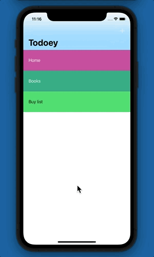

# Todoey
### This is a todolist app to keep track of all your tasks
The goal of this app is to understand how to save data in iOS
App uses Realm to store info about created categories and tasks inside of each category
Functionality: App uses 2 screens, on the first one it's possible to create a new categories, color of each of them sets automatically with ChameleonFramework; 
By tapping on the plus sign on the right top, pop-up alert will be triggered, which allows you to create a new category. Empty name for category or tasks is not allowed. When tap on a category, todo list will open, where you can add a new tasks, mark them as "done", search through or delete. Categories can be deleted with all stored tasks inside.
This project was created with Realm, frameworks 'SwipeCellKit' and 'ChameleonFramework'.
MVC pattern was used.

#### Make sure to set correct access permissions after installation.

